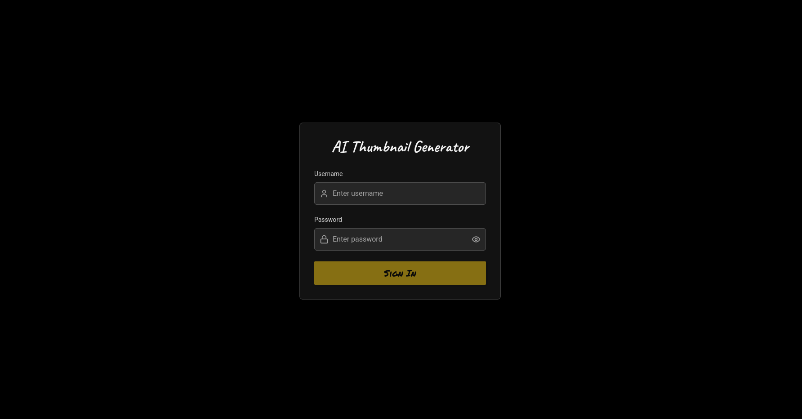
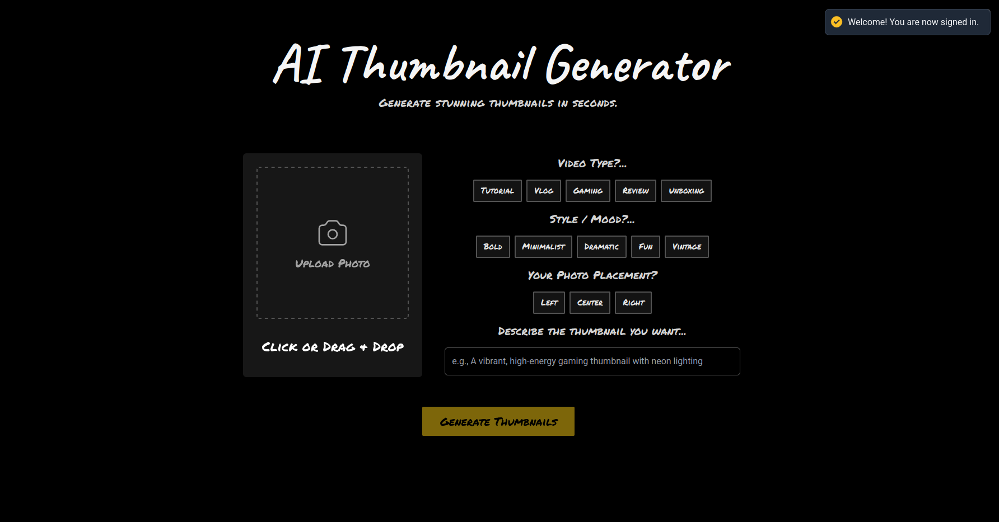
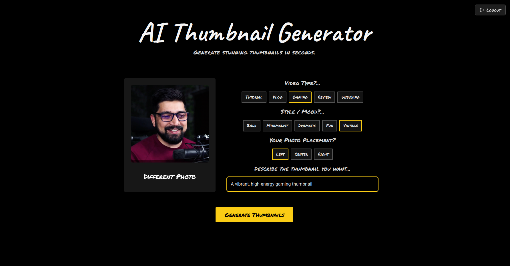
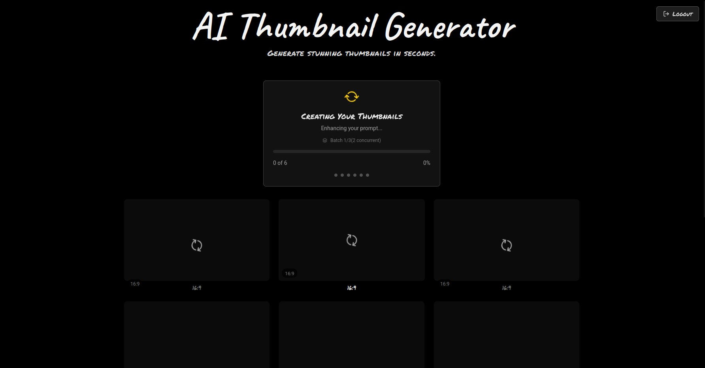
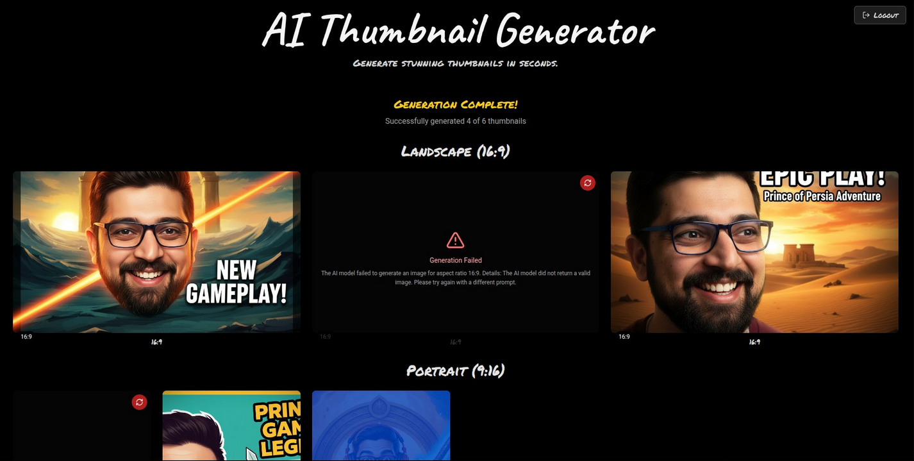

# AI Thumbnail Generator

Generate YouTube thumbnails instantly using AI. Upload a photo, add context, and get AI-crafted results in both 16:9 and 9:16 aspect ratios.

## Screenshots

### Sign In


### Set Your Preferences


### Generate Thumbnail


### Preview


### Final Results


## Installation

```bash
npm install
```

## Configuration

Users sign in with their Google account, handled by [Supabase Auth](https://supabase.com/docs/guides/auth). The Gemini API key lives only on the server, in the Vercel functions under `api/`, which generate thumbnails only for signed-in users.

| Variable | Purpose |
| --- | --- |
| `GEMINI_API_KEY` | Gemini API key used for prompt enhancement and image generation. Server-only. |
| `VITE_SUPABASE_URL` | Supabase project URL. Public. |
| `VITE_SUPABASE_PUBLISHABLE_KEY` | Supabase publishable key (`sb_publishable_...`). Public. |

**Production:** set all three in Vercel under Project → Settings → Environment Variables.

**Local:** copy the example file and fill it in:

```bash
cp .env.example .env
```

### Supabase setup

1. Create a project at [supabase.com](https://supabase.com), then copy the project URL and publishable key from Project Settings → API Keys.
2. Under Authentication → URL Configuration, set **Site URL** to your production URL and add `http://localhost:3000` to **Redirect URLs**. Google sign-in sends users back here.

### Google sign-in

1. In [Google Cloud Console](https://console.cloud.google.com/auth/clients/create), create an OAuth client of type **Web application**.
   - **Authorized JavaScript origins:** your production URL and `http://localhost:3000`.
   - **Authorized redirect URIs:** the callback URL shown in Supabase under Authentication → Sign In / Providers → Google. It looks like `https://<project-ref>.supabase.co/auth/v1/callback`.
2. On the Google Auth Platform consent screen, add the `openid`, `userinfo.email` and `userinfo.profile` scopes, and set the app name and logo users will see.
3. In Supabase under Authentication → Sign In / Providers → Google, enable the provider and paste the client ID and client secret.

## Running

Local development uses the [Vercel CLI](https://vercel.com/docs/cli), which serves the frontend and the `api/` functions together, as in production:

```bash
npm install -g vercel
```

```bash
vercel link
```

```bash
vercel dev
```

Open http://localhost:3000

## Build

```bash
npm run build
```
